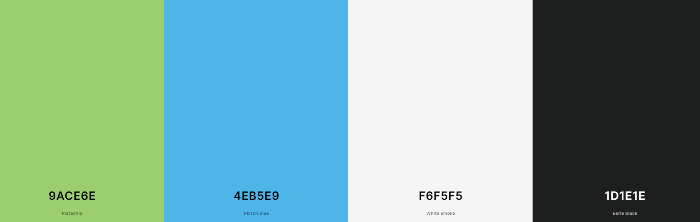

## Notes

done:
- vanilla CSS style and HTML
- vanilla JS logic with  DOM manipulation and reading

need:
- add max cap for the user's input
- add style variant (original version is using Bootstrap)
- ask what needs to be done/fixed/added
___
#### Color Scheme
