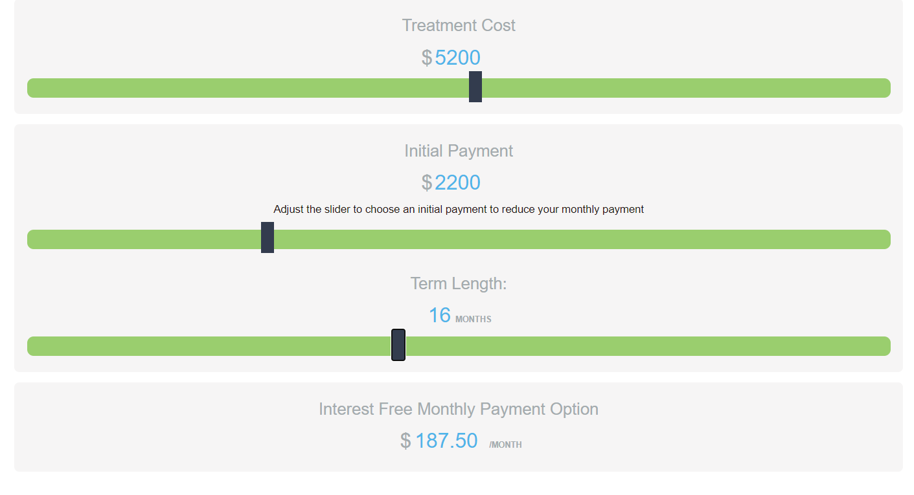

## Slider Calculator for https://beyondbraces.ca/

## Notes

done:
- vanilla CSS style and HTML
- vanilla JS logic with  DOM manipulation and reading
- did the same as the example (using jQuery) working with the same style
- another type with proper colors and more rounded handlers

need:
- ⚠️add max cap for the user's input 
- add style variant
- ask what needs to be done/fixed/added
- Error Handling: When dealing with user input and calculations,  For example, if the user enters non-numeric values or if there are issues with calculations, you might want to provide feedback or prevent incorrect input.
- ❗Deploy for presentation
___
### Variants
___
#### Basic

___
#### Fancy2

---
#### Fancy (did not pass)

